# YapBay Escrow Contract for Sui Move 

## MVP with Sequential Mode, Dual Deadlines & Dispute Resolution

This project implements an escrow solution written in Move for deployment on the Sui testnet. The contract has been designed to support both standard peer-to-peer (P2P) transactions and chained remittance (sequential) trades, incorporating dual deadlines and a dispute resolution mechanism.

## Table of Contents

- [Overview](#overview)
- [Features](#features)
- [Contract Requirements and Flow](#contract-requirements-and-flow)
- [Project Structure](#project-structure)
- [Setup and Deployment](#setup-and-deployment)
- [Testing](#testing)
- [Escrow Flow Diagram](#escrow-flow-diagram)
- [License](#license)
- [Contributing](#contributing)

## Overview

The escrow contract is designed to securely hold USDC funds on-chain until agreed conditions are met. It provides an end-to-end solution covering the complete trade lifecycle from escrow creation through funding, fiat payment confirmation, releasing or cancellation of funds and handling disputes.

Key aspects of the implementation include:

- **Sequential Mode:**  
  In a sequential (chained remittance) trade, the Buyer for the first leg pre-creates the escrow for the second leg. The address of the sequential escrow is embedded into the leg1 escrow, preventing the Seller from arbitrarily choosing the destination for released funds.

- **Dual Deadlines:**  
  The escrow enforces:
  - A **Deposit Deadline** of 15 minutes (from order initiation) to create and fund the escrow.
  - A **Fiat Payment Deadline** of 30 minutes (post-funding) for the Buyer to confirm that fiat payment has been made.

- **Dispute Resolution:**  
  If either party raises an issue after fiat payment is confirmed, the contract supports a dispute resolution process that involves a designated Arbitrator.

- **USDC Token Integration:**  
  The contract operates exclusively with USDC on the Sui Testnet, using the address specified for the testnet.

## Features

- **Escrow Lifecycle Management:**  
  Create, fund, release and cancel escrows based on clearly defined deadlines and conditions.

- **Sequential Trading Support:**  
  Enable chained remittance trades by ensuring the Buyer provides a pre-defined sequential escrow address. This guarantees that funds are immediately transferred to the correct destination when released.

- **Dual Deadline Enforcement:**  
  Strict timestamps for deposit and fiat payment ensure faster dispute resolution and secure fund management.

- **Dispute Handling:**  
  Both parties can open disputes after fiat payment has been confirmed. A designated Arbitrator (fixed address) can resolve disputes by either releasing or canceling funds.

- **Event Logging:**  
  All state transitions—creation, funding, release, cancellation and dispute resolution—are logged on-chain for full auditability.


## Contract Requirements and Flow

The escrow contract operates via the following primary functions:

1. **Escrow Creation (`create_escrow`):**  
   - Called by the Seller.
   - Sets parameters such as trade_id (follows a specific naming convention, e.g., 4500 for leg1, 4501 for leg2), deposit and fiat deadlines, sequential flag and, if applicable, the pre-created sequential escrow address.

2. **Funding (`fund_escrow`):**  
   - The Seller deposits USDC (capped at 100 USDC) within the deposit deadline.
   - Transitions the escrow state from “Created” to “Funded.”

3. **Fiat Payment Confirmation (`mark_fiat_paid`):**  
   - The Buyer confirms fiat payment on-chain.
   - Once set, the Seller is prevented from canceling the escrow. The escrow remains in the "Funded" state.

4. **Releasing Funds (`release_escrow`):**  
   - The Seller (or arbitrator in disputes) releases funds.
   - For standard transactions, funds go directly to the Buyer.
   - For sequential transactions, funds are automatically transferred to the pre-defined sequential escrow account.

5. **Cancellation (`cancel_escrow` & `auto_cancel`):**  
   - If funding does not occur or fiat payment is not confirmed in time, the escrow can be canceled.
   - Cancellation returns funds to the Seller and sets the state to “Cancelled.”

6. **Dispute Resolution (`open_dispute` & `resolve_dispute`):**  
   - Either party can open a dispute after fiat is confirmed.
   - The Arbitrator makes the final decision to either release the funds or cancel the escrow.

Get more details in the [contract requirements document(docs/contract_reqs.md)].

### Escrow Flow Overview

Below is a concise explanation of the escrow flow:

- **Creation & Funding:**  
  The Seller initiates and funds the escrow. If funding does not occur within 15 minutes, the escrow is auto-canceled.

- **Fiat Payment:**  
  The Buyer confirms fiat payment within 30 minutes, setting a flag that prevents the Seller from canceling the order.

- **Release:**  
  The Seller releases funds:
  - **Standard Trade:** Direct payment to the Buyer.
  - **Sequential Trade:** Automatic transfer to the Buyer’s pre-created sequential escrow account.

- **Dispute Handling:**  
  In case of issues, a dispute is opened and resolved by the Arbitrator. The final decision adjusts the final state (resolved release or cancellation).


## Project Structure

```
/escrow-contract
  ├── README.md               # This file
  ├── MOVE.toml               # Move project configuration
  ├── sources/
  │    ├── escrow.move        # Main escrow contract source code
  │    └── types.move         # Data structures and types used
  ├── tests/
  │    ├── escrow_tests.move  # Unit tests for internal functions
  │    └── integration_tests.move   # Integration tests on Sui testnet
  └── docs/
       └── escrow_flow.svg      # Flow Chart diagram SVG file
```


## Setup and Deployment

### Prerequisites

- **Move CLI:**  
  Install the latest version of Move CLI for compiling and testing Move contracts.
  
- **Sui Testnet Access:**  
  Ensure you have access to the Sui Testnet.

- **Rust and Cargo:**  
  Necessary for building Move projects.

### Deployment Steps

1. **Clone the Repository:**  
   ```bash
   git clone https://github.com/Panmoni/yapbay-contracts-sui.git
   cd yapbay-contracts-sui
   ```

2. **Install Dependencies:**  
   Follow steps as documented in the Move CLI documentation to install necessary dependencies.

3. **Build the Contract:**  
   ```bash
   move build
   ```

4. **Deploy to Sui Testnet:**  
   Use the provided scripts or commands in the repository to deploy the contract to Sui Testnet.

5. **Verify Deployment:**  
   Test the deployed contract using the provided testing scripts and user interface.


## Testing

### Unit Testing

- Unit tests for individual functions (such as `create_escrow`, `fund_escrow`, etc.) are (will be) located in the `tests/` directory.
- To run tests:
  ```bash
  move test
  ```

### Integration Testing

- Integration tests simulate end-to-end scenarios on the Sui Testnet.
- Refer to the `integration_tests.move` file for detailed test cases covering both standard and sequential flows, dispute handling and deadline enforcement.


## Escrow Flow Diagram



## License

This project is licensed under the MIT License. See the [LICENSE](LICENSE) file for further details.


## Contributing

Contributions and feedback are welcome! Please open an issue or submit a pull request for any improvements, bug fixes or feature suggestions.

## About

See https://YapBay.com for more information.

Thank you for checking out the contract.