# YapBay Sui Escrow Contract Requirements
## MVP with Sequential Mode, Dual Deadlines & Pre-Defined Sequential Escrow

This document details the requirements for an on-chain escrow contract written in Move for deployment on the Sui testnet. The contract implements a sequential escrow mechanism for both P2P and chained remittance trades using USDC. It enforces strict rules for deposit, fiat confirmation, cancellation, release and dispute handling.

## 1. Overview and Objectives

**Purpose:**  
Provide a secure on-chain escrow mechanism that locks USDC (up to 100 USDC per escrow in the MVP) until trade conditions are met. Depending on the outcome:
- Funds are released to the Buyer (or, in sequential chains, transferred into a pre-created sequential escrow account for leg2) when the trade is successful.
- Funds are returned to the Seller if the escrow is canceled or any dispute is resolved in the Seller’s favor.

**Key Objectives:**  
- Enforce a strict state flow:  
  Creation → Funding → (Fiat Confirmation → Release / Cancellation / Dispute → Resolution)
- Clearly define roles:
  - **Seller:** Creates, funds and (in normal flow) releases or cancels the escrow. May only open disputes after fiat is confirmed.
  - **Buyer:** Receives funds; must confirm fiat payment on-chain by calling `mark_fiat_paid`. For sequential trades, the Buyer (in leg1) must pre-create their leg2 escrow account (in which they act as the Seller) so that funds have a secure and predetermined destination.
  - **Arbitrator:** A designated address (0x4ac605c28e73b516db9d0bf4caf538790558a73d7ce6b837fb69449eebfb431d) that resolves disputes and triggers auto-cancellation if deadlines are exceeded.
- Support chained remittance trades via the boolean flag `sequential`.
- Use USDC from the Sui testnet at: `0xa1ec7fc00a6f40db9693ad1415d0c193ad3906494428cf252621037bd7117e29::usdc::USDC`
- Enforce two deadlines:
  - **Deposit Deadline:** 15 minutes from order initiation.
  - **Fiat Payment Deadline:** 30 minutes after funding.
- Follow a trade identifier convention (e.g., trade 45 [in Postgres] becomes 4500 for leg1 and 4501 for leg2) to unambiguously associate each trade with its leg.
- Ensure that once fiat is confirmed on-chain, the Seller is disallowed from canceling the escrow.
- For sequential trades, require that the Buyer pre-defines (via an on-chain parameter) the sequential escrow address. This field is then used by the `release_escrow` function so that the destination of funds is predetermined and not subject to Seller manipulation.

## 2. Scope and Assumptions

**Scope:**  
- Implements on-chain escrow operations: creation, funding, marking fiat as paid, release, cancellation, dispute handling and auto-cancellation.
- Supports both standard (P2P) escrow and sequential (chained remittance) trades via the `sequential` flag.
- Enforces two deadlines:
  - **Deposit Deadline:** The escrow must be created and funded within 15 minutes (this may also be enforced externally by the API).
  - **Fiat Payment Deadline:** The Buyer must call `mark_fiat_paid` within 30 minutes after funding.
- For sequential trades, the Buyer is required to pre-create their leg2 escrow account (in which they are the Seller) and supply its address as part of the leg1 escrow creation process.

**Assumptions:**  
- All token operations use USDC exclusively at this time.
- Deadlines are measured using on-chain timestamps or block heights.
- Seller, Buyer and Arbitrator addresses are authenticated through the Move runtime.
- Trade identifiers follow the agreed convention (e.g., 4500 for leg1, 4501 for leg2, etc.).
- Users without an on-chain wallet are expected to immediately obtain one via zklogin or dynamic.xyz at account creation time.
- Funds remain exclusively under on-chain custody at all times.

## 3. Data Structures and State Variables

### Escrow Record

Each escrow instance is represented by a struct with the following fields:

- **escrow_id (u64):**  
  A unique identifier for the escrow instance.

- **trade_id (u64 or String):**  
  An off-chain trade identifier that follows the convention (e.g., 4500 for leg1, 4501 for leg2) to distinguish each trade and its leg.

- **seller (address):**  
  The Seller’s address responsible for creating, funding and (in normal flow) releasing or canceling the escrow.

- **buyer (address):**  
  The Buyer’s address designated to receive the funds.  
  *Note:* In leg1 of a sequential trade, the Buyer is required to pre-create and supply the address of their leg2 escrow account.

- **arbitrator (address):**  
  A fixed address: `0x4ac605c28e73b516db9d0bf4caf538790558a73d7ce6b837fb69449eebfb431d`  
  Responsible for dispute resolution and auto-cancellation.

- **amount (u64):**  
  The USDC amount (in the smallest denomination) to be deposited.  
  **Constraint:** Must not exceed the equivalent of 100 USDC.

- **deposit_deadline (u64):**  
  A timestamp or block height indicating the deadline (15 minutes from initiation) by which the escrow must be created and funded.

- **fiat_deadline (u64):**  
  A timestamp or block height indicating the deadline (30 minutes after funding) by which the Buyer must call `mark_fiat_paid`.

- **state (EscrowState):**  
  Enumerated values representing the current state:
  - `Created` – Escrow initialized but not yet funded.
  - `Funded` – Funds have been deposited.
  - `Released` – Funds have been released (either directly to the Buyer or into the sequential escrow for leg2).
  - `Cancelled` – Escrow cancelled; funds returned to the Seller.
  - `Disputed` – A dispute has been opened.
  - `Resolved` – Dispute resolution is complete.

- **sequential (bool):**  
  Indicates if the escrow is part of a chained remittance trade.  
  If `true`, then the Buyer must provide the address of the sequential escrow account for leg2.

- **sequential_escrow_address (address):**  
  **Mandatory if** `sequential = true`.  
  This field holds the address of the pre-created leg2 escrow account.  
  The Seller of leg1 does not control or set this field; it must be provided by or updated by the Buyer during or immediately after the `mark_fiat_paid` call.

- **fiat_paid (bool):**  
  A flag set by the Buyer via `mark_fiat_paid` when fiat payment is confirmed. Once set, cancellation by the Seller is disallowed.

- **counter (u64):**  
  An optional sequential marker that increments on each valid state transition for audit logging and event correlation.

## 4. Functional Requirements

### A. Escrow Creation

**Function:**  
`create_escrow(seller, buyer, arbitrator, amount, deposit_deadline, fiat_deadline, trade_id, sequential, sequential_escrow_address?)`

**Preconditions:**
- Must be called by the Seller.
- Valid addresses for Seller, Buyer and Arbitrator.
- The `amount` must be non-zero and ≤ 100 USDC.
- Valid deposit and fiat deadlines are provided (15 minutes and 30 minutes respectively).
- A valid `trade_id` is provided following the agreed convention.
- If `sequential` is true, the Buyer must provide the `sequential_escrow_address` (or update it via a dedicated function before release).

**Postconditions:**
- A new escrow instance is created with state `Created`, the specified `sequential` flag and (if applicable) the provided `sequential_escrow_address`.
- A unique `escrow_id` is assigned.
- An **EscrowCreated** event is emitted with details including `trade_id`, `sequential` flag, deadlines and (if sequential) the `sequential_escrow_address`.

### B. Funding the Escrow

**Function:**  
`fund_escrow(escrow_id, coin)`

**Preconditions:**
- The escrow must be in the `Created` state.
- The coin provided must be USDC (from the specified testnet address) and must match the `amount` exactly.
- Funding must occur before the deposit_deadline.

**Postconditions:**
- USDC funds are locked in the escrow.
- The state transitions from `Created` to `Funded`.
- The sequential counter is incremented.
- A **FundsDeposited** event is emitted including `escrow_id`, `trade_id`, deposited amount, updated counter and timestamp.

### C. Marking Fiat as Paid

**Function:**  
`mark_fiat_paid(escrow_id)`

**Preconditions:**
- The escrow must be in the `Funded` state.
- Must be called by the Buyer.
- Must occur before the fiat_deadline expires.

**Postconditions:**
- The `fiat_paid` flag is set to true.
- A **FiatMarkedPaid** event is emitted including `escrow_id`, `trade_id` and timestamp.
- For sequential trades, the Buyer is responsible for ensuring that the sequential escrow address is provided (if not already supplied) during escrow creation.

*Rationale:*  
This on-chain action confirms fiat payment. Once marked, the Seller is prevented from canceling the escrow and the flow continues towards releasing funds to the appropriate destination.

### D. Releasing the Escrow

**Function:**  
`release_escrow(escrow_id)`

**Preconditions:**
- The escrow must be in the `Funded` state.
- The `fiat_paid` flag must be true (or, in dispute resolution, the Arbitrator may override).
- Only the Seller (in the normal flow) or the Arbitrator (in dispute resolution) may call this function.
- **If `sequential = true`:** The escrow record must contain a valid `sequential_escrow_address` provided by the Buyer.

**Postconditions:**
- **Standard Trade (`sequential = false`):**  
  Funds are transferred directly to the Buyer and the state transitions to `Released`.
- **Sequential Trade (`sequential = true`):**  
  Funds are automatically transferred to the pre-defined sequential escrow account (at `sequential_escrow_address`) and the state transitions to `Released`.
- In either case, the sequential counter is incremented and an **EscrowReleased** event is emitted with details including `escrow_id`, `trade_id`, buyer, released amount, updated counter, timestamp and a destination indicator (e.g., "direct to buyer" or "sequential escrow [trade_id]").

### E. Cancelling the Escrow

**Function:**  
`cancel_escrow(escrow_id)`

**Preconditions:**
- The escrow must be in the `Created` or `Funded` state.
- For a funded escrow:
  - If fiat is not marked as paid and the fiat_deadline has expired, cancellation is allowed.
  - If fiat is marked as paid, cancellation is disallowed.
- Cancellation may also be triggered by the Arbitrator (e.g., via auto-cancellation) if deadlines are exceeded.

**Postconditions:**
- Funds are returned to the Seller.
- The state transitions to `Cancelled`.
- The sequential counter is incremented.
- An **EscrowCancelled** event is emitted with details including `escrow_id` and `trade_id`.

### F. Dispute Handling

#### 1. Opening a Dispute

**Function:**  
`open_dispute(escrow_id)`

**Preconditions:**
- The escrow must be in the `Funded` state.
- A dispute may be opened only if fiat has been marked as paid.
- Either the Buyer or the Seller may call this function.

**Postconditions:**
- The escrow state transitions to `Disputed`.
- The sequential counter is incremented.
- A **DisputeOpened** event is emitted with details including `escrow_id`, `trade_id`, the disputing party and timestamp.

#### 2. Resolving a Dispute

**Function:**  
`resolve_dispute(escrow_id, decision)`

**Preconditions:**
- The escrow must be in the `Disputed` state.
- Must be called by the Arbitrator.
- The `decision` parameter (boolean) indicates the outcome:
  - `true`: Release funds (to the Buyer or into the sequential escrow).
  - `false`: Cancel the escrow (return funds to the Seller).

**Postconditions:**
- The state is updated to `Resolved` based on the decision.
- The sequential counter is incremented.
- A **DisputeResolved** event is emitted with details including `escrow_id`, `trade_id`, the Arbitrator’s decision, updated counter and timestamp.

#### 3. Auto-Cancellation on Deadline

**Function:**  
`auto_cancel(escrow_id)`

**Preconditions:**
- Can be executed only by the Arbitrator.
- The current on-chain timestamp exceeds either the fiat_deadline (for funded escrows) or the deposit_deadline (for escrows not yet funded).
- The escrow is not already in a terminal state (`Released`, `Cancelled` or `Resolved`).

**Postconditions:**
- Funds are returned to the Seller.
- The state transitions to `Cancelled`.
- The sequential counter is incremented.
- An **EscrowCancelled** event is emitted, documenting auto-cancellation due to deadline expiry.

## 5. Sequential Escrow Mechanism (Chained Remittance)

- The boolean flag `sequential` indicates that the escrow is part of a multi-leg remittance trade.
- **Standard (sequential = false):**  
  The escrow follows the regular lifecycle: Created → Funded → (Fiat Confirmed → Release/Cancel/Dispute → Resolved).
- **Sequential (sequential = true):**
  - For multi-leg trades, the Buyer (of leg1) must pre-create their leg2 escrow account (in which they act as the Seller) and supply its address in the field `sequential_escrow_address` (either during escrow creation or via an update function prior to release).
  - Upon release of leg1 funds, the `release_escrow` function automatically routes funds to the pre-defined sequential escrow account.
  - The **EscrowReleased** event includes a destination indicator specifying "sequential escrow [trade_id]" to confirm the target destination.

## 6. Event Logging

Every critical action emits an event to ensure transparent and auditable state transitions:

- **EscrowCreated:**  
  Emits details: `escrow_id`, `trade_id`, seller, buyer, arbitrator, amount, deposit_deadline, fiat_deadline, `sequential` flag, (if sequential, the `sequential_escrow_address`) and timestamp.

- **FundsDeposited:**  
  Emits details: `escrow_id`, `trade_id`, deposited amount, updated counter and timestamp.

- **FiatMarkedPaid:**  
  Emits details: `escrow_id`, `trade_id` and timestamp. This indicates that fiat payment has been confirmed and (for sequential trades) prompts the Buyer to supply the sequential escrow address if not already provided.

- **EscrowReleased:**  
  Emits details: `escrow_id`, `trade_id`, buyer, released amount, updated counter, timestamp and a destination indicator (e.g., "direct to buyer" or "sequential escrow [trade_id]").

- **EscrowCancelled:**  
  Emits details: `escrow_id`, `trade_id`, seller, refunded amount, updated counter and timestamp.

- **DisputeOpened:**  
  Emits details: `escrow_id`, `trade_id`, the disputing party and timestamp.

- **DisputeResolved:**  
  Emits details: `escrow_id`, `trade_id`, the Arbitrator’s decision, updated counter and timestamp.

## 7. Error Handling and Security

**Input Validation:**  
- Reject zero or negative amounts.
- Enforce that the `amount` does not exceed 100 USDC.
- Validate all addresses (Seller, Buyer, Arbitrator and if sequential, the sequential escrow address).

**Authorization:**  
- Only the Seller may create, fund, release (in normal flow) or cancel the escrow (subject to deadlines and fiat payment status).
- Only the Buyer can call `mark_fiat_paid` and provide/update the sequential escrow address.
- Disputes may only be opened if fiat has been marked as paid.
- Only the Arbitrator can resolve disputes and trigger auto-cancellation.

**Deadline Enforcement:**  
- Deposit Deadline (15 minutes) must be met; if not, `auto_cancel` may be invoked.
- Fiat Payment Deadline (30 minutes post-funding) is critical—before this deadline, the Seller may not cancel; after this deadline, if fiat is not confirmed, cancellation is permitted.

**Error Code Mapping:**  
Each error scenario will return a specific error code to simplify debugging and handling. Some example mappings include:

| Error Code | Description                                                  |
|------------|--------------------------------------------------------------|
| E100       | Invalid amount: Zero or negative value provided.             |
| E101       | Amount exceeds maximum limit (100 USDC).                     |
| E102       | Unauthorized caller: Function called by an invalid user.     |
| E103       | Deposit deadline expired.                                    |
| E104       | Fiat payment deadline expired.                               |
| E105       | Invalid escrow state transition.                             |
| E106       | Missing sequential escrow address for sequential trades.     |
| E107       | Escrow already in a terminal state (Released, Cancelled or Resolved). |

**Exception Handling:**  
- If the deposit or fiat deadline is exceeded, automatically trigger `auto_cancel` and emit an **EscrowCancelled** event with the corresponding error code (e.g., `E103` for deposit and `E104` for fiat).
- If a function is called out of sequence (i.e., an invalid state transition), revert the transaction with error code `E105`.
- For unauthorized access attempts, immediately revert with error code `E102`.

## 8. Testing and Validation Strategy

**Testing Scenarios:**

- **Positive Flows:**
  - Standard escrow creation, funding, fiat confirmation and release.
  - Sequential escrow creation with a pre-defined sequential escrow address, funding, fiat confirmation and automatic routing of funds.
  - Dispute opening and resolution covering both release and cancellation outcomes.

- **Negative Flows:**
  - Attempts to fund or release an escrow after the corresponding deadline has expired.
  - Unauthorized function calls (e.g., non-Seller invoking `create_escrow` or non-Buyer invoking `mark_fiat_paid`).
  - Input validations such as exceeding the 100 USDC cap or missing the sequential escrow address when `sequential = true`.

- **Edge Cases:**
  - Simultaneous or concurrent operations on the same escrow instance to test the integrity of the sequential counter and proper event logging.
  - Auto-cancellation triggered via deadline expiry under varying timing conditions.

- **Event Logging Verification:**
  - Ensure that every state transition emits the correct event with all required details.
  - Validate that the events include appropriate error codes and counter increments.

- **Gas and Sponsored Transactions (Post-MVP):**
  - This release does not implement sponsored transactions. All transactions will incur user-supplied gas fees.
  - Future integration tests will verify the correct operation of sponsored transactions once implemented in the post-MVP roadmap.

## 9. Post-MVP Roadmap: Sponsored Transactions

**Overview:**  
In a future iteration, we will integrate Sui sponsored transactions to cover gas fees, thereby easing the on-boarding process for users new to web3 and improving asset management.

**Key Points for Future Implementation:**
- **User-Initiated Sponsored Transactions:**  
  A user generates a GasLessTransactionData transaction and sends it to a sponsor for processing.
- **Sponsor-Initiated Sponsored Transactions:**  
  The sponsor creates a TransactionData object complete with gas fee details, signs it and returns it for the user to dual-sign.
- **GasData Object Usage:**  
  The sponsor may provide a GasData object that covers gas fees up to a determined budget.
- **Risks and Mitigation:**  
  - Equivocation must be mitigated to prevent double-spending or locking objects in non-finalized states.
  - Future implementations will include establishing a Sui gas station to monitor real-time gas prices, manage gas pools, enforce rate limits and detect abuse.

*Note:*  
Currently, the MVP relies solely on user-supplied gas (on testnet). Sponsored transaction functionality is planned for post-MVP development.

## 10. Post-MVP Roadmap: Signature-Based Verification for Sequential Escrow Address

To eliminate the risk of the seller tampering with the sequential escrow address, a future enhancement will require the buyer to cryptographically prove control of that address. Instead of allowing the seller to set or update the sequential_escrow_address, the contract will include a dedicated update function that verifies a digital signature produced by the buyer. 

For now, the frontend and/or API will assist the Buyer in verifying that the `sequential_escrow_address` is correct.

## 11. Summary

This document outlines the requirements for the YapBay Sui Escrow Contract. The design ensures a secure and auditable on-chain escrow mechanism using USDC on the Sui testnet. With support for sequential trades, enforcement of dual deadlines and robust dispute resolution, this system guarantees that funds remain under secure on-chain custody until all agreed conditions are met. The additional details on error handling, extensive testing strategies and a future roadmap for sponsored transactions demonstrate our commitment to developing a resilient and user-friendly escrow solution.

## Addendum

Here is the escrow flow diagram.

