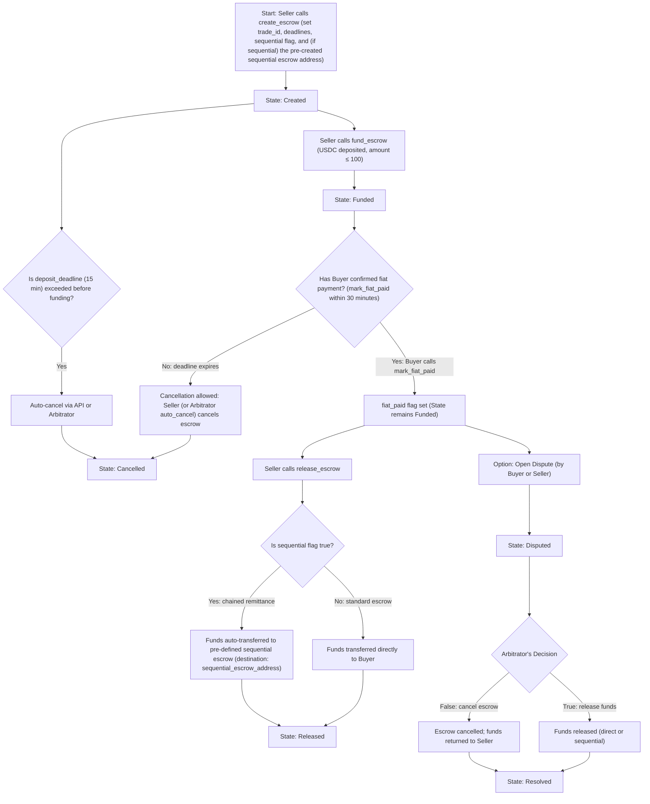

# Escrow Flow

## Explanation of the YapBay Escrow Flow

### 1. Creation and Funding

- **Start (Node A):**  
  The process begins when the Seller calls the `create_escrow` function. In this step, the Seller provides parameters such as the trade_id, deadlines (deposit and fiat), the sequential flag, and—if the trade is sequential—the pre-created sequential escrow address.

- **State: Created (Node B):**  
  Once the escrow is created, it enters the "Created" state.

- **Funding the Escrow (Node C):**  
  The Seller calls the `fund_escrow` function to deposit USDC. The deposit amount must not exceed 100 USDC. After the funds are deposited, the status of the escrow updates.

- **State: Funded (Node D):**  
  USDC is now locked in the escrow and its state is updated to "Funded."

### 2. Fiat Payment Confirmation and Cancellation

- **Fiat Confirmation Check (Node E):**  
  A decision point is reached where the Buyer must confirm fiat payment by calling the `mark_fiat_paid` function within 30 minutes.

- **Cancellation Path (Nodes F and G):**  
  - If the Buyer does not confirm fiat payment before the deadline, cancellation is permitted.  
  - Cancellation may be initiated by the Seller or via auto-cancellation triggered by the Arbitrator, and the escrow moves to the "Cancelled" state.

- **Fiat Confirmation (Node H):**  
  If the Buyer calls `mark_fiat_paid` within the deadline, the fiat_paid flag is set while the escrow remains "Funded."

### 3. Releasing Funds

- **Releasing Funds (Node K):**  
  After fiat confirmation, the Seller calls the `release_escrow` function.

- **Sequential Decision (Node L):**  
  The process checks whether the escrow is part of a sequential (chained remittance) trade:
  
  - **Standard Escrow (Node M):**  
    If `sequential` is false, funds are transferred directly to the Buyer.
  
  - **Sequential Trade (Node O):**  
    If `sequential` is true, funds are automatically transferred to the pre-defined sequential escrow account (using the supplied sequential_escrow_address).

- **State: Released (Node N):**  
  After funds are released in either case, the escrow transitions to the "Released" state.

### 4. Dispute Resolution

- **Dispute Option (Node P):**  
  After fiat payment is confirmed, either the Buyer or the Seller can open a dispute.

- **Disputed State (Node Q):**  
  Once a dispute is raised, the escrow enters the "Disputed" state.

- **Arbitrator Decision (Node R):**  
  The Arbitrator reviews the dispute and makes one of the following decisions:
  
  - **Release Decision (Nodes S and T):**  
    If the decision is to release funds, they are transferred according to the standard or sequential process, and the escrow reaches the "Resolved" state.
  
  - **Cancellation Decision (Nodes U and T):**  
    If the decision is to cancel the escrow, funds are returned to the Seller and the escrow then moves to the "Resolved" state.

### 5. Auto-Cancellation Before Funding

- **Deposit Deadline Check (Nodes V and W):**  
  Before funding, if the deposit is not made within the 15-minute deposit_deadline, an auto-cancellation is triggered (either via an API or by the Arbitrator). This moves the escrow directly to the "Cancelled" state.