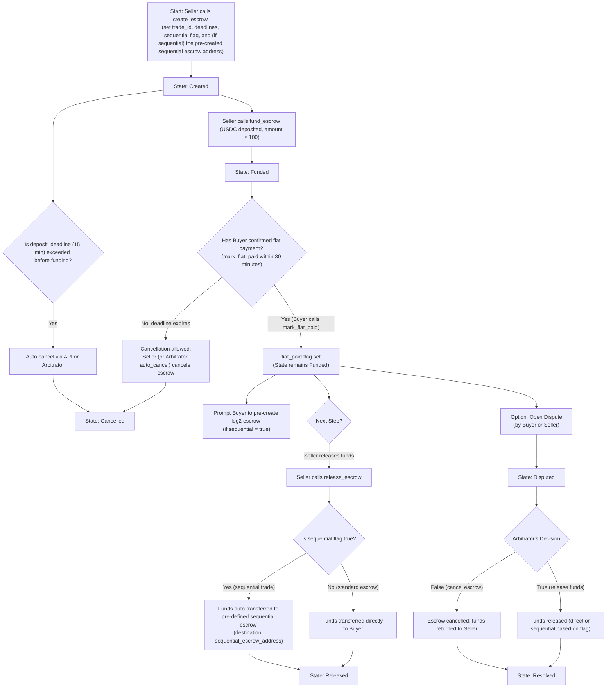

# Escrow Flow

### Explanation of the Flow

1. **Creation and Funding**
   - **Create Escrow:** The Seller initiates the trade using `create_escrow` by providing parameters such as the trade_id (using the convention, e.g., 4500 for leg1), deadlines, the sequential flag, and—if applicable—the pre-created sequential escrow address (for leg2).
   - **Fund Escrow:** The Seller then funds the escrow with USDC (capped at 100 USDC). The state updates from "Created" to "Funded".

2. **Fiat Payment Confirmation & Deadlines**
   - **Fiat Not Confirmed:** If the Buyer does not call `mark_fiat_paid` within the 30-minute fiat deadline, cancellation becomes allowed. The Seller or Arbitrator (through auto_cancel) can then cancel the escrow.
   - **Fiat Confirmed:** When the Buyer calls `mark_fiat_paid`, the fiat_paid flag is set. For sequential trades, this action prompts the frontend to have the Buyer confirm or pre-create their leg2 escrow account.

3. **Release or Dispute**
   - **Release Funds:** After fiat payment is confirmed, the Seller calls `release_escrow`.  
     • If the trade is standard (sequential = false), funds are released directly to the Buyer.  
     • If the trade is sequential (sequential = true), funds are automatically transferred to the pre-defined sequential escrow account (using the provided sequential_escrow_address).  
     The EscrowReleased event will include a destination indicator (e.g., "direct to Buyer" or "sequential escrow [trade_id 4501]").
   - **Open Dispute:** Alternatively, after fiat confirmation, either party (Buyer or Seller) may open a dispute. The state changes to "Disputed" and the Arbitrator later resolves it. The resolution may either release funds (if decision is true) or cancel the escrow (if decision is false).

4. **Auto-Cancellation Before Funding**
   - If the escrow is not funded within the 15-minute deposit deadline (enforced externally or via an auto_cancel function), the escrow is cancelled and funds (if any) are returned to the Seller.

This flowchart and explanation should help visualize the complete escrow process, ensuring clarity on decision points, deadlines, sequential flows, and dispute-resolution mechanisms.